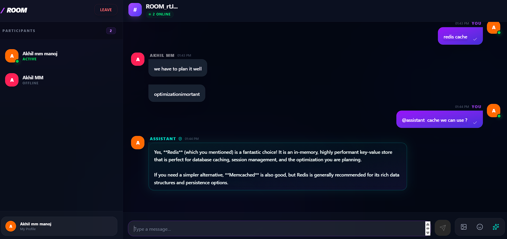
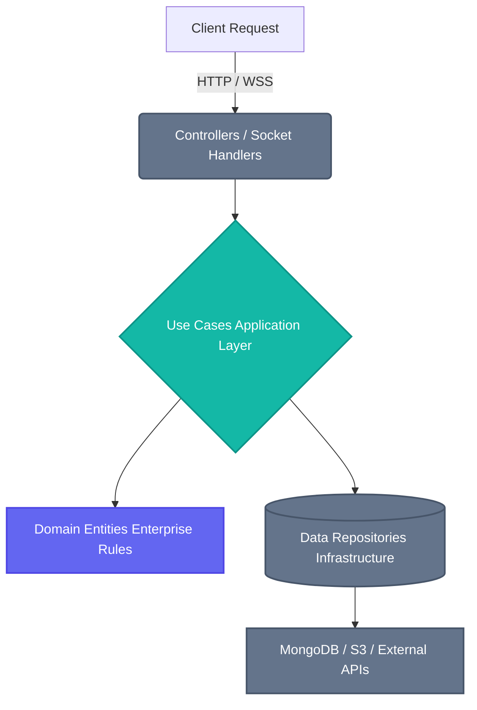
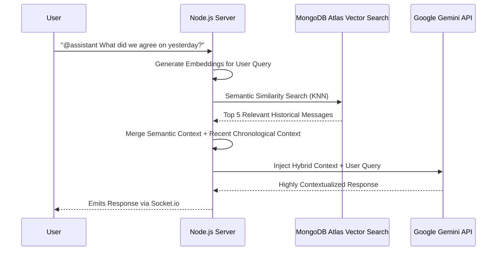

# 💬 Enterprise Chat API & AI RAG Engine


A high-performance, real-time backend engine for an enterprise group chat application. Built with strict **Clean Architecture** principles, this server features a custom **Retrieval-Augmented Generation (RAG)** AI pipeline, WebSocket-driven real-time communication, and secure media offloading via AWS S3.

## 📸 Real-Time Communication Demo
> **Note to Developer:** Replace the placeholder below with a GIF showing the chat working seamlessly between two browser tabs.



---

## 🏛️ System Architecture

This project strictly adheres to **Clean Architecture** and **Domain-Driven Design (DDD)**. This ensures that enterprise business logic is completely decoupled from UI, databases, and external frameworks, resulting in a highly testable and scalable codebase.

### Clean Architecture Flow


### AI Retrieval-Augmented Generation (RAG) Pipeline
Instead of relying on basic, contextless AI prompts, this server implements a highly intelligent RAG pipeline. It utilizes **MongoDB Atlas Vector Search** to semantically retrieve relevant historical messages, dynamically merging them with chronological context to generate highly accurate AI responses.



---

## ✨ Core Technical Achievements

- **Retrieval-Augmented Generation (RAG):** Implemented a custom pipeline using `gemini-embedding-2` and Vector Search to give the AI deep, historical context of the chat room.
- **AWS S3 Presigned URLs:** Architected a zero-bandwidth media offloading system. Clients request a secure token and upload media directly to the cloud, preventing Node.js Out-Of-Memory (OOM) crashes during high traffic.
- **Real-Time WebSockets:** Utilized `Socket.io` for instant message delivery, live typing indicators, and real-time online presence tracking.
- **Secure Authentication:** Implemented robust JWT access and refresh token rotation, alongside Google OAuth 2.0 integration.

---

## 🛠️ Tech Stack

- **Core:** Node.js, Express, TypeScript
- **Architecture:** Clean Architecture, Domain-Driven Design (DDD)
- **Database & AI:** MongoDB, Mongoose, MongoDB Atlas Vector Search, Google Gemini API
- **Real-time:** Socket.io
- **Cloud & Security:** AWS S3, JWT (JSON Web Tokens), bcrypt
- **Code Quality:** ESLint, Prettier

---

## 🚀 Local Environment Setup

### Prerequisites
- Node.js (v18+ recommended)
- MongoDB running locally or a MongoDB Atlas URI

### Installation

1. **Clone the repository**
   ```bash
   git clone https://github.com/yourusername/chat-app-server.git
   cd chat-app-server
   ```

2. **Install dependencies**
   ```bash
   npm install
   ```

3. **Environment Variables**
   Create a `.env` file in the root directory and add the following keys:
   ```env
   # Server
   PORT=5000
   NODE_ENV=development
   CLIENT_URL=http://localhost:5173

   # Database
   MONGODB_URI=your_mongodb_connection_string

   # Authentication
   JWT_ACCESS_SECRET=your_access_secret
   JWT_REFRESH_SECRET=your_refresh_secret

   # AI Integration
   GEMINI_API_KEY=your_gemini_api_key

   # AWS S3 (Media Uploads)
   AWS_REGION=your_aws_region
   AWS_ACCESS_KEY_ID=your_access_key
   AWS_SECRET_ACCESS_KEY=your_secret_key
   AWS_BUCKET_NAME=your_bucket_name
   ```

4. **Start the Development Server**
   ```bash
   npm run dev
   ```

---

*Designed and engineered by AKHIL MM*
